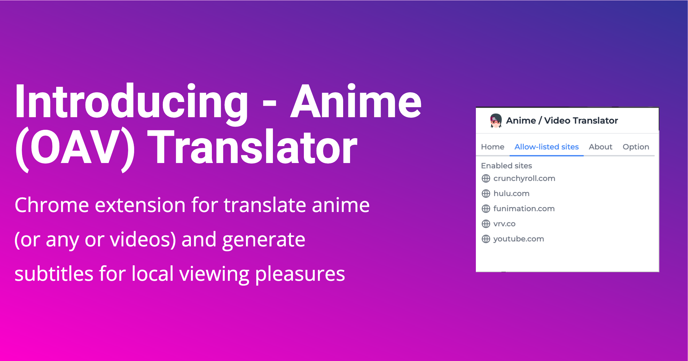

# Anime (or any other video) Translator



Anime OAV (Anime or any other video) is a Chrome extension that automatically translate, transcribes, and generates overlaying subtitles for videos.

### Features
- Audio transcribing
- Text translation
- Render subtitles onto videos
- Multiple text translation engines: **Azure Cognitive Translator**, **Google Cloud Translation**

## Usage
Set Deepgram and translator engine credentials in `src/config.ts`.

The translator engine can be changed in `src/background.ts` like below:
```javascript
const translator = 
TranslatorFactory.createTranslator(Translators.AZURE);
...
const translator = 
TranslatorFactory.createTranslator(Translators.GOOGLE);
```

Clone the repo:
`https://github.com/gregorygaines/anime-aov-translator.git`

Start extension dev server:
`npm run start`

Load extension into browser by
1. Open the Extension Management page by navigating to chrome://extensions.
2. Enable Developer Mode by clicking the toggle switch next to Developer mode.
3. Click the LOAD UNPACKED button and select the extension directory `dist`.

### Quirks

The project is in early infancy and the features above may not work properly.
For now, Crunchyroll is the only site that works properly.

#### Transcribing
Navigate to a Crunchyroll video, then click the extension and change the status to 'Enabled'.
Subtitles should start appearing, if not, refresh the page and try the process again.

#### Stopping an active transcribing
Closing or navigating to another tab should stop the transcribing.

## Screenshots


